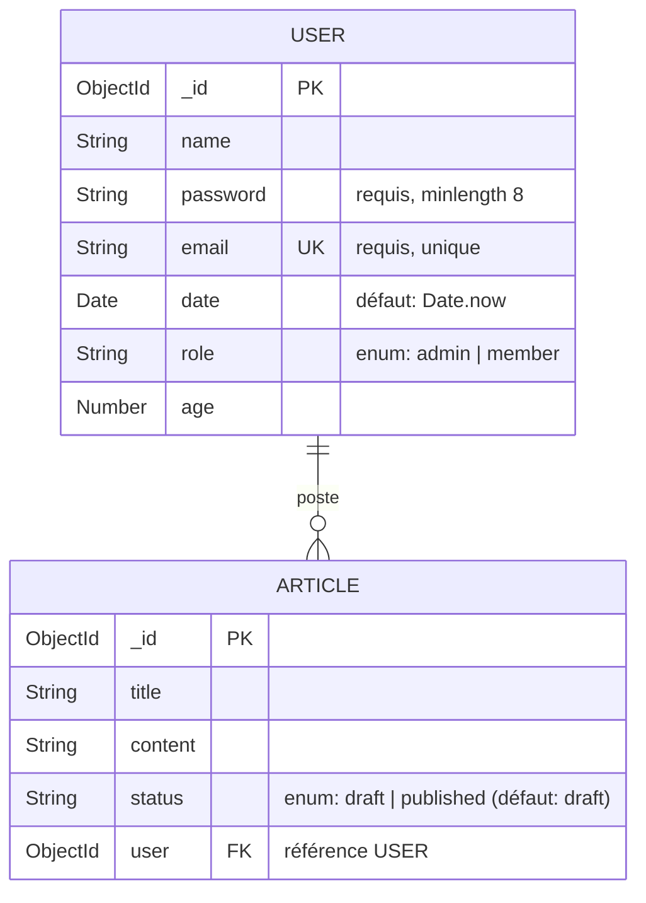

# Diagramme UML de la base de données

Modèle de données de l'application, dérivé des schémas Mongoose de `api/users/users.model.js` et
`api/articles/articles.schema.js`. Deux entités, reliées par une relation **1-N** : un utilisateur
peut poster plusieurs articles ; chaque article appartient à un seul utilisateur
(`Article.user` référence `User`).

## Légende

- **PK** : clé primaire (`_id`, généré par MongoDB).
- **UK** : clé unique (`User.email`).
- **FK** : clé étrangère (`Article.user` → `User._id`).
- **`||--o{`** : cardinalité 1-N — un `USER` (côté `1`) possède zéro, un ou plusieurs `ARTICLE`
  (côté `N`).

## Correspondance avec le code

| Entité | Fichier source | Particularités |
|---|---|---|
| `User` | `api/users/users.model.js` | `email` en minuscules et `password` hashé (bcrypt) via des hooks `pre("save")` |
| `Article` | `api/articles/articles.schema.js` | `status` par énumération (Q2) ; `user` peuplé sans le mot de passe pour l'endpoint public (Q4) |
